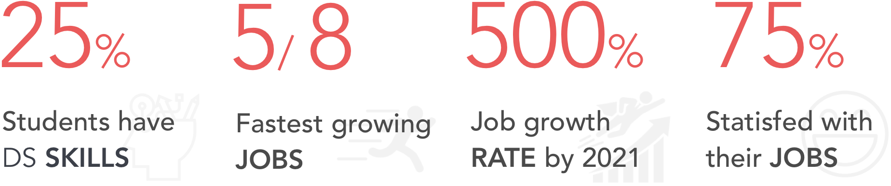
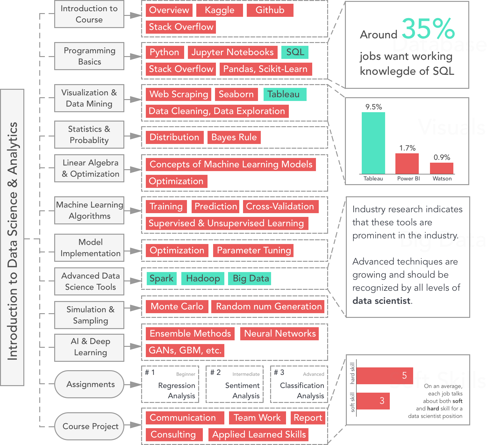

# Course Curriculum Resdesign using Data Science

A new course curriculum based on current and future job market trends.

### Technologies Used
iPython Jupyter Notebook
Python packages like NLTK, Panda, Seaborn, Scikit, Beautiful soup, etc.

 

